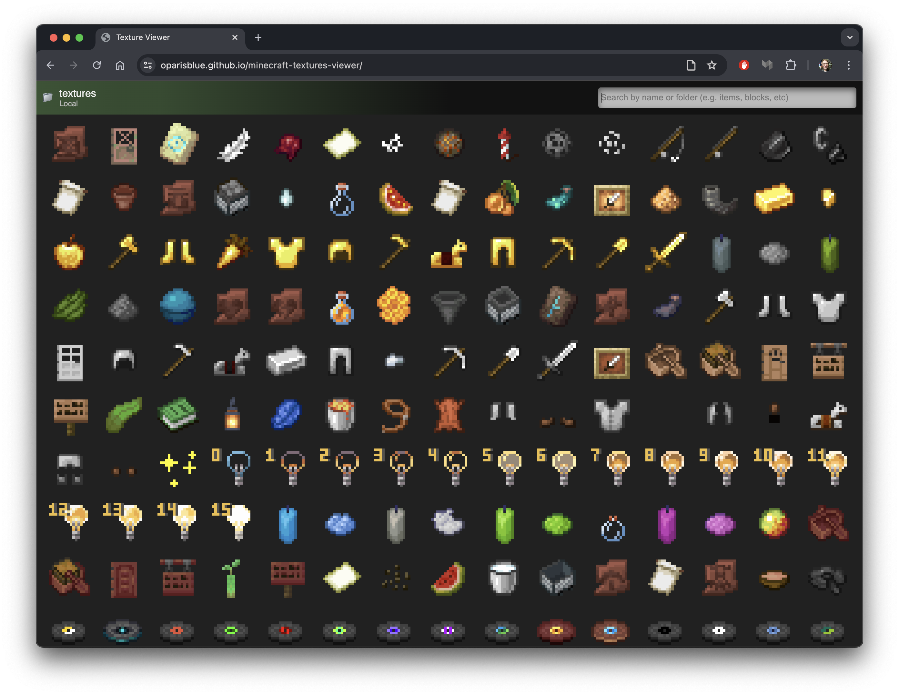

# Minecraft Textures Viewer

A simple viewer for Minecraft texture folders.

- Can preview textures animated with `.mcmeta` files
- Can load projects both from your local computer and from GitHub

---

Try it online with your own files at https://oparisblue.github.io/minecraft-textures-viewer!

Just select the menu at the top-left, and choose "Open from your computer". Alternatively, there are some fantastic texture repos which exist here on GitHub, and you can use this to generate a gallery view of them, e.g:

- [Gallery view of malcolmriley/unused-textures](https://oparisblue.github.io/minecraft-textures-viewer/#github/malcolmriley/unused-textures/master) (github [here](https://github.com/malcolmriley/unused-textures))
- [Gallery view of Foreck1/foreck-textures](https://oparisblue.github.io/minecraft-textures-viewer/#github/Foreck1/foreck-textures/main) (github [here](https://github.com/Foreck1/foreck-textures))
- [Gallery view of Futureazoo/TextureRepository](https://oparisblue.github.io/minecraft-textures-viewer/#github/Futureazoo/TextureRepository/master) (github [here](https://github.com/Futureazoo/TextureRepository))
- ...any many others --- you can select "Open from GitHub" to open any other similar texture repo with this tool.
